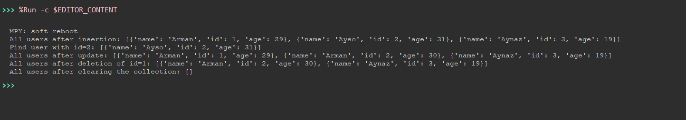
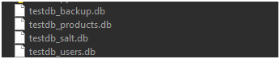

# unosql - A Lightweight Encrypted NoSQL Database for MicroPython

`unosql` is a lightweight, serverless NoSQL database designed for the MicroPython environment. It supports AES encryption for secure data storage and enables CRUD (Create, Read, Update, Delete, Backup) operations on collections stored in JSON format.

## Features

- **NoSQL Database**: Stores data in JSON format, allowing easy collection management.
- **AES Encryption**: Provides AES encryption (ECB mode) to secure your data using a 16-byte encryption key.
- **Collection-Based Storage**: Allows data to be stored and retrieved in separate collections.
- **CRUD Operations**: Supports adding, searching, updating, deleting, and reading all records.
- **Key-Value Pair Searching**: Efficiently find and filter data based on key-value pairs.
- **Secure Key Generation**: Generates encryption keys securely using HMAC and SHA256.
- **Serverless**: Perfect for use in embedded systems like ESP32, ESP8266, or other MicroPython-compatible boards.


### Install in MicroPython Environment

Ensure you're using the MicroPython environment. If you haven't installed MicroPython yet, download it from the official site.

To install `unosql` in your MicroPython environment, use the `upip` package manager:

```bash
upip install unosql
```

Then import the library:

```python
from unosql import unosql
```

No additional dependencies are required.

## Usage

### 1. Creating a Database

To create a new database, instantiate the `unosql` class with the database name. Optionally, you can provide an encryption key (16 bytes) for data encryption.

```python
db = unosql("my_database", encryption_key=b"16bytekey1234567")
```

### 2. Inserting Records

Use the `insert` method to add a new record (a dictionary) to a collection:

```python
db.insert("users", {"id": 1, "name": "Arman", "age": 29})
```

### 3. Finding Records

To find records that match a key-value pair, use the `find` method:

```python
db.find("users", "id", 1)
```

### 4. Updating Records

To update records based on a key-value match, use the `update` method:

```python
db.update("users", "id", 1, {"name": "Arman", "age": 30})
```

### 5. Deleting Records

To delete records that match a key-value pair, use the `delete` method:

```python
db.delete("users", "id", 1)
```

### 6. Reading All Records

Use the `all` method to retrieve all records in a collection:

```python
db.all("users")
```

### 7. Clearing a Collection

To clear all records from a collection, use the `clear` method:

```python
db.clear("users")
```

### 8. Backup and Restore

You can back up the entire database to a file or restore it from a backup:

```python
# Backup the database
db.backup("backup.db")

# Restore the database from a backup
db.restore("backup.db")
```

## Example Usage

Here’s a simple example demonstrating how to use `unosql`:

```python

# --- Comprehensive Test Suite ---
if __name__ == "__main__":
    def run_tests():
        print("Starting Unosql Test Suite...\n")

        # Initialize database with encryption
        db = Unosql("testdb", encryption_key=b"1234567890abcdef")
        
        # Test 1: Insert records
        print("Test 1: Inserting records")
        db.insert("users", {"name": "Alice", "age": 25})
        db.insert("users", {"name": "Bob", "age": 30})
        db.insert("users", {"name": "Charlie", "age": 35})
        assert db.count("users") == 3, "Insert failed: wrong count"
        print(f"Inserted 3 records, count: {db.count('users')} - PASS")

        # Test 2: Find records
        print("\nTest 2: Finding records")
        alice_records = db.find("users", "name", "Alice")
        assert len(alice_records) == 1 and alice_records[0]["age"] == 25, "Find failed"
        print(f"Found Alice: {alice_records} - PASS")

        # Test 3: Update records
        print("\nTest 3: Updating records")
        updated = db.update("users", "name", "Alice", {"age": 26})
        assert updated and db.find("users", "name", "Alice")[0]["age"] == 26, "Update failed"
        print(f"Updated Alice's age to 26: {db.find('users', 'name', 'Alice')} - PASS")

        # Test 4: Delete records
        print("\nTest 4: Deleting records")
        deleted_count = db.delete("users", "name", "Bob")
        assert deleted_count == 1 and db.count("users") == 2, "Delete failed"
        print(f"Deleted Bob, remaining count: {db.count('users')} - PASS")

        # Test 5: Get all records
        print("\nTest 5: Getting all records")
        all_users = db.all("users")
        assert len(all_users) == 2, "All records fetch failed"
        print(f"All users: {all_users} - PASS")

        # Test 6: Get last N records
        print("\nTest 6: Getting last 1 record")
        last_record = db.get_last_n_records("users", 1)
        assert len(last_record) == 1 and last_record[0]["name"] == "Charlie", "Last N failed"
        print(f"Last record: {last_record} - PASS")

        # Test 7: Get records in timeframe
        print("\nTest 7: Getting records in timeframe")
        start_time = utime.time() - 10  # Within last 10 seconds
        end_time = utime.time() + 10
        recent_records = db.get_records_in_timeframe("users", "timestamp", start_time, end_time)
        assert len(recent_records) == 2, "Timeframe filter failed"
        print(f"Records in timeframe: {recent_records} - PASS")

        # Test 8: Clear collection
        print("\nTest 8: Clearing collection")
        db.clear("users")
        assert db.count("users") == 0, "Clear failed"
        print(f"Cleared users, count: {db.count('users')} - PASS")

        # Test 9: Backup and restore
        print("\nTest 9: Backup and restore")
        db.insert("users", {"name": "David", "age": 40})
        db.insert("users", {"name": "Eve", "age": 28})
        db.backup("testdb_backup.db")
        db.clear("users")
        assert db.count("users") == 0, "Pre-restore count failed"
        db.restore("testdb_backup.db")
        assert db.count("users") == 2, "Restore failed"
        print(f"Restored users: {db.all('users')} - PASS")

        # Test 10: Error handling - Invalid record
        print("\nTest 10: Error handling - Invalid record")
        try:
            db.insert("users", "not_a_dict")
            print("Insert with invalid record should have failed - FAIL")
        except ValueError:
            print("Caught invalid record error - PASS")

        # Test 11: Error handling - Restore non-existent file
        print("\nTest 11: Error handling - Restore non-existent file")
        try:
            db.restore("non_existent_file.db")
            print("Restore with non-existent file should have failed - FAIL")
        except OSError:
            print("Caught non-existent file error - PASS")

        # Test 12: Multiple collections
        print("\nTest 12: Multiple collections")
        db.insert("products", {"name": "Laptop", "price": 1000})
        db.insert("products", {"name": "Phone", "price": 500})
        assert db.count("products") == 2 and db.count("users") == 2, "Multiple collections failed"
        print(f"Users: {db.count('users')}, Products: {db.count('products')} - PASS")

        print("\nAll tests completed successfully!")

    # Run the tests
    run_tests()

```

## Requirements

- **MicroPython**: This library is designed for use with MicroPython on ESP32, ESP8266, or other compatible boards.

## License

This project is licensed under the MIT License. See the LICENSE file for details.

## Test Images



