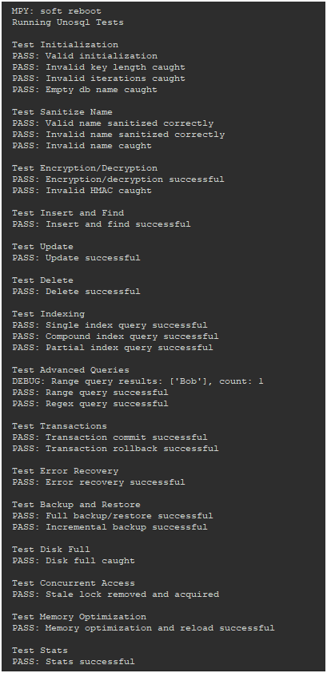

# Unosql - 🚀 Secure NoSQL Database for MicroPython


**Unosql** is a lightweight, serverless NoSQL database crafted for **MicroPython**, optimized for resource-constrained microcontrollers like ESP32 and STM32. With **AES-CBC encryption**, **atomic transactions**, and compliance with **MISRA** and **ISO 26262**, it’s perfect for critical industries such as hospitality, healthcare, automotive, and IoT. Secure, reliable, and efficient, Unosql empowers embedded systems with robust data management.

---

## 📋 Table of Contents

- [🌟 Features](#-features)
- [🛠️ Installation](#-installation)
- [📖 Usage](#-usage)
- [💻 Example Usage](#-example-usage)
- [📦 Requirements](#-requirements)
- [🧪 Test Suite](#-test-suite)
- [📊 Performance Tips](#-performance-tips)
- [📜 License](#-license)

---

## 🌟 Features

| Feature | Description |
|---------|-------------|
| 🗄️ **NoSQL Flexibility** | Stores data in JSON format for schema-less, modular collections. |
| 🛡️ **AES-CBC Encryption** | Secures data with 256-bit AES-CBC and HMAC-SHA256 integrity using a 32-byte key. |
| 📥 **Compression** | Optional `uzlib` compression to save storage, with uncompressed fallback. |
| 🔄 **Atomic Transactions** | Ensures data consistency with rollback and stale lock detection for critical operations. |
| 🔍 **Compound Indexing** | Single and multi-key indexing, including partial indexes, for fast queries. |
| 📝 **Record Versioning** | Tracks changes with version numbers and timestamps for audit trails. |
| 🔒 **Concurrency Control** | File-based locking with configurable timeouts and stale lock removal. |
| 💾 **Backups** | Full and incremental backups with checksums for data integrity. |
| 🛠️ **Error Recovery** | Recovers from corruption or hardware failures using backups and atomic writes. |
| 💡 **Memory Optimization** | Unloads collections to free RAM on low-memory devices. |
| 📜 **Logging** | Configurable logging (DEBUG, INFO, ERROR) with log rotation. |
| 🔐 **Key Derivation** | PBKDF2-like SHA256 with 16-byte salt for secure key generation. |
| ✅ **Standards Compliance** | Adheres to MISRA (type safety, validation) and ISO 26262 (fault tolerance). |
| 🌐 **Serverless** | Ideal for IoT and embedded systems, no external dependencies needed. |

---

## 🛠️ Installation

1. **MicroPython Setup**: Ensure MicroPython v1.22+ is installed on your device (e.g., ESP32, STM32). Download from [micropython.org](https://micropython.org).
2. **Copy Unosql**: Transfer `unosql.py` to your device using tools like `ampy`, `rshell`, or WebREPL:
   ```bash
   ampy --port /dev/ttyUSB0 put unosql.py
   ```
3. **Import Library**:
   ```python
   from unosql import Unosql
   ```

**Note**: No external dependencies are needed beyond MicroPython’s built-in modules (`ujson`, `uos`, `uhashlib`, `utime`, `ubinascii`, `cryptolib`). For compression, enable `MICROPY_PY_UZLIB` in your MicroPython build.

---

## 📖 Usage

### 🗄️ Create a Database
Initialize a database with a name and a 32-byte encryption key for secure storage:
```python
db = Unosql("iot_db", encryption_key=b"32_bytekey1234567890123456789012", iterations=1000, log_level="INFO")
```

### 📝 Insert Records
Add records to a collection with automatic `id`, `timestamp`, and `version`:
```python
db.insert("patients", {"patient_id": "P001", "heart_rate": 72})
```

### 🔍 Query Records
Search records using simple or advanced queries (e.g., `gt`, `lt`, `regex`):
```python
results = db.find("patients", {"patient_id": "P001"})
```

### 🔄 Update Records
Update records with version increment and timestamp refresh:
```python
db.update("patients", "patient_id", "P001", {"heart_rate": 75})
```

### 🗑️ Delete Records
Remove records matching a key-value pair:
```python
db.delete("patients", "patient_id", "P001")
```

### 🔄 Atomic Transactions
Ensure data consistency with transactions:
```python
with db.transaction("patients") as tx:
    tx.insert({"patient_id": "P002", "heart_rate": 70})
    tx.update("patient_id", "P002", {"heart_rate": 71})
```

### 💾 Backup & Restore
Securely back up and restore data:
```python
db.backup("iot_db_backup.db")
db.incremental_backup("iot_db_inc_backup.db", since_timestamp=utime.time() - 3600)
db.restore("iot_db_backup.db")
```

### 💡 Optimize Memory
Free RAM on low-memory devices:
```python
db.optimize_memory()
```

---

## 💻 Example Usage

This example demonstrates `Unosql` in a **hotel IoT system** for managing room sensor data:

```python
import utime
from unosql import Unosql

# Initialize secure database
db = Unosql("hotel_db", encryption_key=b"32_bytekey1234567890123456789012", iterations=1000, log_level="INFO")

# Create index for fast room queries
db.create_index("rooms", ["room_id", "timestamp"])

# Insert sensor data
db.insert("rooms", {"room_id": "R101", "temperature": 22.5, "occupancy": True})
db.insert("rooms", {"room_id": "R101", "temperature": 23.0, "occupancy": True})

# Atomic transaction for consistent updates
with db.transaction("rooms") as tx:
    tx.insert({"room_id": "R102", "temperature": 21.0, "occupancy": False})
    tx.update("room_id", "R102", {"temperature": 21.5})

# Query recent sensor data
recent = db.get_records_in_timeframe("rooms", "timestamp", utime.time() - 3600, utime.time())
print(f"Recent room data: {recent}")

# Backup data
db.backup("hotel_db_backup.db")

# Optimize memory for low-RAM devices
db.optimize_memory()

# Database statistics
stats = db.get_stats()
print(f"Hotel database stats: {stats}")
```

---

## 📦 Requirements

- **MicroPython**: v1.22+ for optimal performance and `uzlib` support.
- **Built-in Modules**: `ujson`, `uos`, `uhashlib`, `utime`, `ubinascii`, `cryptolib` (included in standard builds).
- **Optional**: `uzlib` for compression (requires `MICROPY_PY_UZLIB` enabled).
- **Storage**: Minimum 4MB flash for database files, backups, and logs (e.g., `hotel_db_errors.log`).
- **Hardware**: ESP32, STM32, ESP8266, or other MicroPython-compatible microcontrollers.

---

## 🧪 Test Suite

`Unosql` includes a comprehensive test suite within `unosql.py`, covering:
- 🔧 Initialization and input validation
- 🔐 Encryption/decryption with HMAC
- 📝 CRUD operations
- 🔍 Compound and partial indexing
- 🔄 Atomic transactions with rollback
- 🛠️ Error recovery
- 💾 Full/incremental backups
- 🔒 Concurrent access with lock handling
- 💡 Memory optimization
- 📊 Statistics generation

Run the tests by copying `test.py` to your device and executing:
```python
import test
# Tests run automatically when executed as main
```

Logs are saved to `<db_name>_errors.log`. All 15 tests should pass, ensuring reliability for critical applications.

**Test Visualization**:


---

## 📊 Performance Tips

- **Storage**: Enable `uzlib` to reduce file size. Uncompressed storage increases flash usage.
- **Memory**: Use `optimize_memory` on devices with limited RAM (e.g., ESP8266). Lazy loading minimizes memory footprint.
- **Concurrency**: Tune `LOCK_TIMEOUT` (default: 20,000ms) and `STALE_LOCK_THRESHOLD` (default: 30,000ms) for high-concurrency scenarios.
- **Encryption**: Adjust `iterations` (default: 1000) based on hardware. Higher values increase security but slow initialization.
- **Indexing**: Create indexes for frequent queries but avoid over-indexing to save storage.

---


## 📜 License

Licensed under the MIT License. See the [LICENSE](LICENSE) file for details.

---


🌟 **Unosql**: Powering secure, efficient data management for the IoT era!